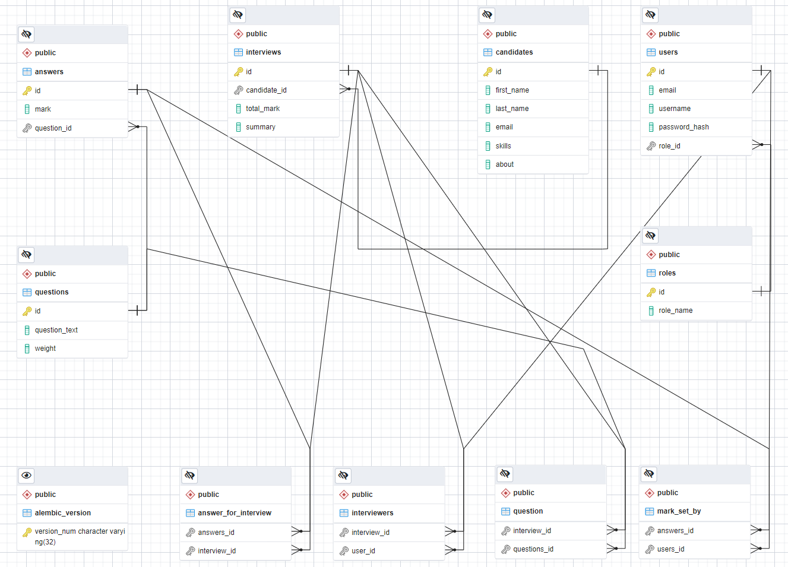

# Interview Platform using Flask

This is the Interview platform pet project created base on Flask framework.

## Installation
In order to pull the repository and run the web application you may follow the next steps:

Create project directory
Linux/Windows:
```bash
mkdir <your_project_directory>
```
Go to created directory:
```bash
cd <your_project_directory/>
```
Clone repository from GitHub via command:
```github
git clone https://github.com/DmytroYahudin/Interview_Platform_Flask.git
```
In order to build docker container you need installed [Docker Compose](https://docs.docker.com/compose/gettingstarted/) in your system.
Make sure that Docker is installed on your pc and build the container:\
Linux:
```bash
sudo docker-compose up -d
```
Windows:
```bash
docker-compose up -d
```

## Usage

You can access to the web application by following the link [http://localhost:5000/](http://localhost:5000/) \
Press the "Log in" button in the application and enter the next email and password:\
email: recr@r.com
password: 123

After you logged in as a "recruiter" you can create the "interviewer" user and log in as an "interviewer"

## ERD



## Contributing
Pull requests are welcome. For major changes, please open an issue first to discuss what you would like to change.

Please make sure to update tests as appropriate.

## License
[MIT](https://choosealicense.com/licenses/mit/)

## References
[Virtual wallet API at GitHub.com](https://github.com/yurikoste/virtual_wallet_api)